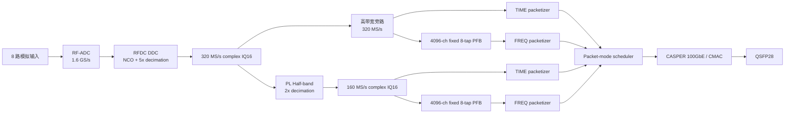
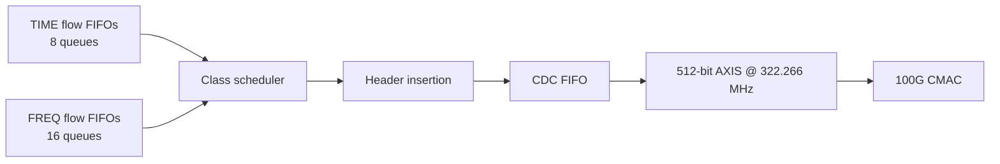
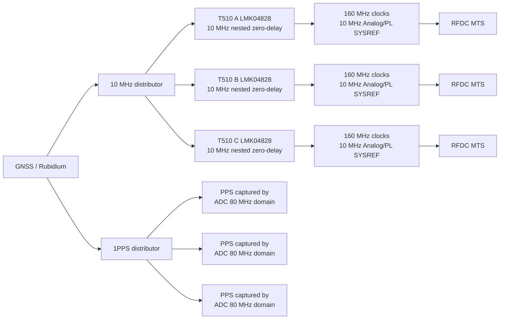
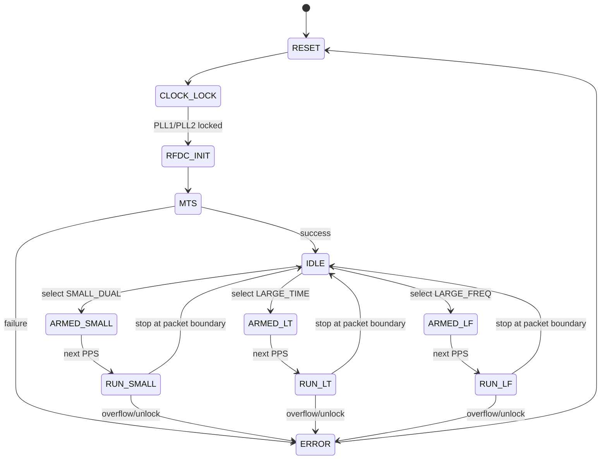

# T510 / RFSoC 单 QSFP28 100GbE 双模式数据输出方案

> **版本**：v1.1
> **目标硬件**：MicroPhase ANTSDR T510 / ZU47DR / LMK04828 / 单 QSFP28 100GbE
> **输入假设**：8 路复数输入，网络量化为 signed IQ16，即每个复样本 32 bit
> **频域处理假设**：4096-channel、固定 8-tap、临界采样 PFB，频域输出同样为 complex IQ16
> **状态**：数据输出架构建议冻结；LMK 时钟基线已修正为同款 T510 论文验证的 10 MHz nested zero-delay 方案。最终 `.tcs`、输出引脚映射和初始化脚本仍需寄存器级复核与上板回归
> **v1.1 关键修订**：不再把“外部 10 MHz 经 `/2` 后生成 5 MHz PLL1 比较频率和 SYSREF”作为主方案。优先复现 Zhou et al. (2026) 在同款 MicroPhase ANTSDR T510 上验证的 10 MHz nested zero-delay 配置。10 MHz SYSREF 与 AMD PG269 当前的 `<10 MHz` 条件存在已知规范偏差，必须作为工程偏差记录并重新回归验证。

---

## 1. 设计目标

板卡只有一个 QSFP28 100GbE 输出口，需要支持以下工作模式：

1. **小带宽双输出模式**
   - 同时输出时域 complex IQ16 UDP；
   - 同时输出频域 complex IQ16 UDP；
   - 两类数据都保持完整时间分辨率，不进行积分或降位宽。

2. **大带宽单输出模式**
   - 只允许输出时域 IQ UDP，或
   - 只允许输出频域 IQ UDP；
   - 两类全分辨率数据不得同时打开。

本方案将 100GbE 的持续占用限制在约 **84%**，保留约 **16%** 的链路裕量，用于吸收：

- CMAC/CASPER 100G 模块的短时反压；
- packet scheduler 的空隙；
- 接收机和交换机的实现差异；
- VLAN 等少量附加开销；
- 工程测试中可能需要的控制包和状态包。

---

## 2. 冻结后的推荐规格

| 模式 | 网络复采样率 | 建议可用科学带宽 | 输出内容 | 科学 payload | 估算线速 | 总包率 |
|---|---:|---:|---|---:|---:|---:|
| `SMALL_DUAL` | 160 MS/s | 约 128 MHz | TIME IQ16 + FREQ IQ16 | 81.92 Gbit/s | 83.86 Gbit/s | 1.25 Mpps |
| `LARGE_TIME` | 320 MS/s | 约 256 MHz | TIME IQ16 only | 81.92 Gbit/s | 83.86 Gbit/s | 1.25 Mpps |
| `LARGE_FREQ` | 320 MS/s | 约 256 MHz | FREQ IQ16 only | 81.92 Gbit/s | 83.86 Gbit/s | 1.25 Mpps |

这里必须区分两个概念：

- **网络复采样率**：实际发往网络的 complex sample rate，例如 320 MS/s；
- **建议可用科学带宽**：考虑 RFDC 数字抽取滤波器的 80% Nyquist 通带后，建议真正使用的平坦频带。

因此：

\[
B_{\rm useful}\approx 0.8F_{\rm complex}.
\]

即：

\[
160\ {\rm MS/s}\rightarrow 128\ {\rm MHz},
\]

\[
320\ {\rm MS/s}\rightarrow 256\ {\rm MHz}.
\]

如果项目中把“320 MHz BW”定义成 **320 MS/s 的复数据速率**，本方案能够达到；如果定义成 **320 MHz 平坦可用科学通带**，则基线模式达不到，见第 16 节的扩展方案。

---

## 3. 关键假设

### 3.1 输入路数和数据格式

- 输入数：

\[
N_{\rm in}=8.
\]

- 每个复数样本：

\[
I={\rm int16},\qquad Q={\rm int16}.
\]

- 每个复样本位数：

\[
N_{\rm bit}=16+16=32\ {\rm bit}.
\]

因此，单个全分辨率数据产品的科学 payload rate 为：

\[
R_{\rm payload}
=
N_{\rm in}F_{\rm complex}N_{\rm bit}.
\]

---

### 3.2 频域输出不会天然降低数据率

对于临界采样 PFB：

\[
N_{\rm chan}=4096,
\]

\[
f_{\rm spectrum}=\frac{F_{\rm complex}}{4096}.
\]

每秒输出的总复数频域样本数为：

\[
4096\times f_{\rm spectrum}
=
F_{\rm complex}.
\]

所以，只要满足以下条件：

- 所有频率通道都输出；
- 不做时间积分；
- 不降低位宽；
- 输出仍为 IQ16；

那么完整频域数据率与时域数据率相同：

\[
R_{\rm FREQ}=R_{\rm TIME}.
\]

固定 8-tap 只增加 PFB 内部计算和存储，不会令网络输出率变成 8 倍。

---

## 4. 100GbE 带宽预算

### 4.1 UDP 包假设

沿用当前 Stage 27j 的大包结构：

- 科学 payload：8192 B；
- T510 application header：128 B；
- UDP header：8 B；
- IPv4 header：20 B；
- Ethernet header：14 B；
- FCS：4 B；
- preamble + SFD：8 B；
- inter-frame gap：12 B。

每个包占用的近似线速字节数：

\[
L_{\rm wire}
=
8192+128+8+20+14+4+8+12
=
8386\ {\rm B}.
\]

相对于科学 payload 的开销系数：

\[
\eta
=
\frac{8386}{8192}
=
1.023681640625.
\]

因此：

\[
R_{\rm wire}
=
\eta R_{\rm payload}.
\]

> 若使用 802.1Q VLAN，每包增加约 4 B，对本方案结论影响很小，但应在最终压力测试中打开真实网络配置验证。

---

### 4.2 单数据产品的理论上限

一个全分辨率 TIME 或 FREQ 数据产品：

\[
R_{\rm wire}
=
8F_{\rm complex}\times32\times\eta.
\]

令其等于 100 Gbit/s，可得理论极限：

\[
F_{\rm max,single}
=
381.59\ {\rm MS/s}.
\]

这个数值是“刚好填满 100GbE”的数学极限，不适合作为长期运行指标。

---

### 4.3 同时输出 TIME 和 FREQ 的理论上限

双输出的数据率加倍：

\[
R_{\rm wire,dual}
=
2\times8F_{\rm complex}\times32\times\eta.
\]

理论极限为：

\[
F_{\rm max,dual}
=
190.79\ {\rm MS/s}.
\]

---

### 4.4 不同工程占用上限

| 允许的 100G 占用 | 单输出最大复采样率 | 双输出最大复采样率 |
|---:|---:|---:|
| 100%：数学极限 | 381.59 MS/s | 190.79 MS/s |
| 95%：风险较高 | 362.51 MS/s | 181.25 MS/s |
| 90%：可测试档 | 343.43 MS/s | 171.71 MS/s |
| 85%：建议生产档 | 324.35 MS/s | 162.18 MS/s |

因此选择：

- 单输出：320 MS/s；
- 双输出：160 MS/s。

两者都落在约 84% 的线速占用，而且具有严格的 2:1 关系，便于共用同一数据通路。

---

## 5. 三种工作模式的精确数据率

### 5.1 `SMALL_DUAL`

每个数据产品：

\[
R_{\rm payload,one}
=
8\times160\,{\rm MHz}\times32
=
40.96\ {\rm Gbit/s}.
\]

TIME + FREQ：

\[
R_{\rm payload,total}
=
81.92\ {\rm Gbit/s}.
\]

线速：

\[
R_{\rm wire}
=
81.92\times1.023681640625
=
83.86\ {\rm Gbit/s}.
\]

---

### 5.2 `LARGE_TIME`

\[
R_{\rm payload}
=
8\times320\,{\rm MHz}\times32
=
81.92\ {\rm Gbit/s}.
\]

\[
R_{\rm wire}
=
83.86\ {\rm Gbit/s}.
\]

---

### 5.3 `LARGE_FREQ`

完整、临界采样、无积分的频域 IQ16 数据率与时域相同：

\[
R_{\rm payload}
=
81.92\ {\rm Gbit/s},
\]

\[
R_{\rm wire}
=
83.86\ {\rm Gbit/s}.
\]

---

## 6. 总体数据通路



模式选择：

```text
SMALL_DUAL:
    320 MS/s -> PL 2x decimator -> 160 MS/s
    TIME160 = ON
    FREQ160 = ON

LARGE_TIME:
    320 MS/s bypass
    TIME320 = ON
    FREQ320 = OFF

LARGE_FREQ:
    320 MS/s bypass
    TIME320 = OFF
    FREQ320 = ON
```

禁止在 `LARGE_TIME` 或 `LARGE_FREQ` 中同时打开两个全分辨率 packetizer。

---

## 7. 为什么固定 RFDC 为 320 MS/s，再在 PL 中产生 160 MS/s

推荐不要在运行时频繁把 RFDC 在 5× 和 10× decimation 之间切换，原因是：

- RFDC decimation 会改变 RFDC 到 PL 的接口数据率；
- 可能改变 AXI4-Stream 的 words-per-clock；
- 可能要求重新初始化 FIFO 和数字路径；
- 在部分工程配置中更适合通过不同 bitstream 实现，而不是在线切换。

推荐固定为：

\[
F_{\rm ADC}=1.6\ {\rm GS/s},
\]

\[
D_{\rm RFDC}=5,
\]

\[
F_{\rm RFDC,out}
=
\frac{1.6\ {\rm GS/s}}{5}
=
320\ {\rm MS/s}.
\]

小带宽模式使用 PL 内自定义 2× half-band：

\[
F_{\rm small}
=
\frac{320}{2}
=
160\ {\rm MS/s}.
\]

优点：

- LMK 配置不变；
- ADC 原始采样率不变；
- RFDC 配置不变；
- MTS 条件不变；
- 模式切换只发生在 PL 路由和 packetizer；
- 三种模式可以共用一个主 bitstream；
- 可在 PPS 边界切换，不需要每次重新锁定 RFDC PLL。

---

## 8. RFDC 配置

### 8.1 固定参数

| 参数 | 配置 |
|---|---:|
| ADC 原始采样率 | 1.6 GS/s |
| RFDC reference clock | 160 MHz |
| RFDC internal PLL | 启用 |
| RFDC PLL 倍频关系 | 160 MHz → 1.6 GHz |
| RFDC 数据类型 | complex I/Q |
| NCO | 48-bit fine mixer，可配置中心频率 |
| RFDC decimation | 5× |
| RFDC 输出率 | 320 MS/s complex |
| 网络输出位宽 | I16 + Q16 |
| MTS | 启用 |
| deterministic latency | 启用并记录 target latency |

ZU47DR 的 quad ADC 采样率上限为 2.5 GS/s，因此 1.6 GS/s 留有充足器件余量。

---

### 8.2 PL 接口并行度

推荐使用 160 MHz 的数据处理时钟。

高带宽模式每路输入在每个 160 MHz PL clock 内携带：

- 2 个 complex sample；
- 每个 complex sample 为 32 bit；
- 每路每拍 64 bit；
- 8 路总计每拍 512 bit。

验证：

\[
160\,{\rm MHz}\times512\,{\rm bit}
=
81.92\ {\rm Gbit/s}.
\]

小带宽模式经过 2× decimation 后：

- 每路每拍 1 个 complex sample；
- 8 路总计每拍 256 bit。

---

## 9. PL 端 2× half-band decimator

建议指标：

| 项目 | 指标 |
|---|---:|
| 输入率 | 320 MS/s complex / input |
| 输出率 | 160 MS/s complex / input |
| 通带 | 输出 Nyquist 的 80% |
| 每侧可用带宽 | 64 MHz |
| 总可用复带宽 | 128 MHz |
| 阻带衰减 | 建议 ≥ 80 dB |
| 通带波纹 | 建议 ≤ 0.1 dB |
| 数据位宽 | 内部保留 guard bits，末端舍入/饱和至 IQ16 |
| 通道一致性 | 所有输入使用相同系数和相同确定性延迟 |

必须输出：

- FIR overflow/saturation counter；
- 每路最大值；
- 舍入饱和次数；
- 固定 group delay 样本数。

所有通道的滤波器 group delay 必须一致，并写入元数据或固件版本说明。

---

## 10. PFB 设计

### 10.1 基线规格

- 4096 channels；
- 4 taps；
- critical sampling；
- complex input；
- complex IQ16 network output；
- 内部乘法和累加使用更高位宽；
- 输出前进行统一 scaling、rounding 和 saturation。

---

### 10.2 频率分辨率和 spectrum-time rate

#### 160 MS/s 模式

\[
\Delta f
=
\frac{160\,{\rm MHz}}{4096}
=
39.0625\ {\rm kHz}.
\]

\[
f_{\rm spectrum}
=
39.0625\ {\rm kspectrum/s}.
\]

#### 320 MS/s 模式

\[
\Delta f
=
\frac{320\,{\rm MHz}}{4096}
=
78.125\ {\rm kHz}.
\]

\[
f_{\rm spectrum}
=
78.125\ {\rm kspectrum/s}.
\]

---

### 10.3 并行实现

建议 PFB 支持：

- 大带宽：2 complex samples/input/clock @ 160 MHz；
- 小带宽：1 complex sample/input/clock @ 160 MHz。

可采用：

- 2-way parallel polyphase architecture；
- 小带宽模式使用 lane-valid 或 clock-enable；
- 保持 PFB 输出 channel ordering 在两种模式下完全一致。

不建议把整个 PFB 主时钟直接提高到 320 MHz，除非时序收敛已经充分验证。

---

## 11. UDP 包格式

## 11.1 公共 128 B T510 header

建议字段：

| 字段 | 建议位宽 | 含义 |
|---|---:|---|
| magic/version | 32 bit | 协议识别和版本 |
| header_length | 16 bit | 固定 128 B |
| packet_type | 8 bit | TIME / FREQ / STATUS |
| mode_id | 8 bit | SMALL_DUAL / LARGE_TIME / LARGE_FREQ |
| board_id | 16 bit | 板卡编号 |
| input_id | 8 bit | TIME 包对应输入 |
| frequency_block_id | 8 bit | FREQ 包对应频率块 |
| pps_epoch | 64 bit | 绝对整秒编号 |
| sample_index | 64 bit | 本秒内首个复样本编号 |
| time_seq | 64 bit | spectrum-time 或 time-block 序号 |
| packet_seq | 64 bit | 对应 UDP flow 的连续包序号 |
| adc_sample_rate | 32 bit | 1.6 GS/s 的编码值 |
| complex_sample_rate | 32 bit | 160 或 320 MS/s |
| nco_frequency | 64 bit | RFDC NCO 设置 |
| channel_start | 32 bit | FREQ 包首通道 |
| channel_count | 16 bit | 通常 256 |
| samples_per_packet | 16 bit | TIME 包通常 2048 |
| flags | 32 bit | lock/MTS/overflow/drop 等 |
| firmware_id | 64 bit | 固件构建标识 |
| reserved/CRC | 剩余 | 扩展和 header CRC |

用于跨板重排的主键建议为：

```text
TIME:
(pps_epoch, sample_index, board_id, input_id)

FREQ:
(pps_epoch, time_seq, board_id, frequency_block_id)
```

---

## 11.2 TIME UDP

推荐每个输入单独一个 UDP flow：

- 8 个输入；
- 每个包只包含一个输入；
- 每包 2048 个 complex IQ16；
- 科学 payload：

\[
2048\times4
=
8192\ {\rm B}.
\]

建议端口：

```text
4200 .. 4207
```

分别对应 input 0 .. 7。

### 包率

#### 160 MS/s

单输入：

\[
\frac{160\,{\rm MS/s}}{2048}
=
78.125\ {\rm kpps}.
\]

8 输入总计：

\[
625\ {\rm kpps}.
\]

每个包覆盖：

\[
\frac{2048}{160\,{\rm MHz}}
=
12.8\ \mu{\rm s}.
\]

#### 320 MS/s

单输入：

\[
156.25\ {\rm kpps}.
\]

8 输入总计：

\[
1.25\ {\rm Mpps}.
\]

每个包覆盖：

\[
6.4\ \mu{\rm s}.
\]

---

## 11.3 FREQ UDP

沿用当前频率切片格式：

- 4096 channels；
- 16 个 frequency blocks；
- 每 block 256 channels；
- 每包包含全部 8 inputs；
- 每个 channel/input 为 complex IQ16。

科学 payload：

\[
256\times8\times4
=
8192\ {\rm B}.
\]

建议端口：

```text
4308 .. 4323
```

并规定：

\[
{\rm channel\_start}
=
256\times{\rm block\_id}.
\]

### 包率

#### 160 MS/s

\[
f_{\rm spectrum}
=
39.0625\ {\rm kHz}.
\]

\[
R_{\rm packet}
=
16\times39.0625
=
625\ {\rm kpps}.
\]

#### 320 MS/s

\[
f_{\rm spectrum}
=
78.125\ {\rm kHz}.
\]

\[
R_{\rm packet}
=
16\times78.125
=
1.25\ {\rm Mpps}.
\]

---

## 12. 一个重要的工程优点

三种模式对 100G packet scheduler 的压力几乎相同：

```text
SMALL_DUAL:
    TIME = 625 kpps
    FREQ = 625 kpps
    TOTAL = 1.25 Mpps

LARGE_TIME:
    TIME = 1.25 Mpps
    TOTAL = 1.25 Mpps

LARGE_FREQ:
    FREQ = 1.25 Mpps
    TOTAL = 1.25 Mpps
```

线速也统一为约：

\[
83.86\ {\rm Gbit/s}.
\]

因此可以使用同一套：

- 100G CMAC 配置；
- FIFO 深度；
- scheduler 性能指标；
- 接收端压力测试；
- 丢包验收标准。

---

## 13. Packet scheduler 和缓存



### 13.1 FIFO 建议

每个 flow 至少缓存 4 个完整 UDP 包：

\[
4\times8192
=
32768\ {\rm B/flow}
\]

不包括 header 和 FIFO 元数据。

建议：

- 深缓存使用 URAM；
- 进入 CMAC 前的 CDC 使用 BRAM/URAM asynchronous FIFO；
- FIFO 必须能够保存完整 packet；
- packet-mode switch 只能在 `tlast` 后切换输入。

---

### 13.2 调度策略

#### `SMALL_DUAL`

在 TIME class 和 FREQ class 之间采用等字节权重：

```text
TIME packet
FREQ packet
TIME packet
FREQ packet
...
```

因为两类 packet 长度相同，可以使用严格交替或 deficit round-robin。

在每个 class 内：

- TIME：8 flows round-robin；
- FREQ：16 flows round-robin。

#### `LARGE_TIME`

只调度 TIME class。

#### `LARGE_FREQ`

只调度 FREQ class。

---

### 13.3 反压和错误处理

必须实现：

- `cmac_tready_low_cycles`；
- `fifo_almost_full_count[flow]`；
- `fifo_overflow_count[flow]`；
- `packet_generated_count[flow]`；
- `packet_sent_count[flow]`；
- `packet_drop_count[flow]`；
- `axis_stall_cycles`；
- 实时 payload rate；
- 实时 estimated wire rate。

如果 FIFO 接近溢出：

1. 不能破坏当前 packet；
2. 在 packet 边界停止；
3. 设置 sticky error flag；
4. 在后续 header 中上报；
5. 默认进入 `ERROR_STOP`，而不是静默丢数据。

---


## 14. LMK04828 时钟方案

### 14.1 决策原则：论文配置是黄金基线

Zhou et al. (2026) 使用的硬件与本项目相同，均为 **MicroPhase ANTSDR T510 / ZU47DR / LMK04828 / 122.88 MHz VCXO / 外部 10 MHz + 1PPS**。论文已经在同款 T510 上验证了 10 MHz nested zero-delay、多 tile MTS、多板 PPS 对齐和重启重复性。

因此 Stage 32 的第一份时钟 profile 不应从零重构，而应采用：

```text
PAPER_GOLDEN
    ↓ 只做必要的输出频率修改
STAGE32_MIN_DELTA
    ↓ clock-only 与 MTS 回归通过后
生产候选
```

以下修改不得同时混入第一份 profile：

- PLL2 PFD 从 0.08 MHz 改为 3.84 MHz；
- SYSREF 从 continuous 改为 pulser/request；
- SYSREF 从 10 MHz 改为 5 MHz；
- PLL1 R 从 1 改为 2；
- 所有 100 MHz 输出无差别改为 160 MHz；
- DCC、half-step、SYNC 序列同时重写。

否则一旦上板失败，无法确定是哪一项引起。

---

### 14.2 Stage 32 时钟目标

| 时钟 | 目标频率 | 用途 | 处理原则 |
|---|---:|---|---|
| external reference | 10 MHz | 全系统公共频率/相位参考 | 保留论文值 |
| VCXO | 122.88 MHz | PLL1 低相噪飞轮 | 保留板载器件 |
| LMK VCO0 | 2400 MHz | secondary clocks 母频 | 保留论文值 |
| RFDC reference | 160 MHz | RFDC internal PLL 输入 | 保留 `/15` |
| Stage 32 PL data/reference | 160 MHz | RFDC-PL 接口与主 F-engine | 仅修改确有需要的论文 100 MHz 输出 |
| auxiliary/control | 100 MHz 或板级要求值 | MMIO、控制或其他消费者 | 不得无依据改动 |
| Analog SYSREF | 10 MHz continuous | RFDC MTS | 保留论文值 |
| PL SYSREF | Stage 32基线为10 MHz continuous；Stage 34c-2R候选为MTS-only | 仅用于RFDC/PL MTS捕获 | PPS不依赖SYSREF；v35按PG269修复160→80 MHz重捕获 |
| ADC sample clock | 1.6 GHz | RFDC internal PLL 生成 | 固定 |
| CMAC clock | 约 322.266 MHz | 100GbE CMAC/GT | 独立时钟域 |

PS MGT、B128/B129 MGT、REF OUT 等输出必须依据 T510 原理图和实际 GT 配置逐项确认，不能因为主数据通路使用 160 MHz，就将所有 LMK 输出统一设成 160 MHz。

---

### 14.3 PLL1：10 MHz nested zero-delay

论文黄金配置为：

\[
f_{\rm ref}=10\ {\rm MHz},\qquad R_1=1,\qquad N_1=1,
\]

\[
f_{\rm PFD1}=10\ {\rm MHz}.
\]

PLL1 feedback 选择 SYSREF divider，反馈频率也是 10 MHz：

```text
外部 10 MHz / 1
        与
SYSREF divider 10 MHz / 1
```

对应结构：

```text
Dual-loop nested zero-delay
PLL1_NCLK_MUX = feedback mux
FB_MUX = SYSREF divider
FB_MUX_EN = enabled
```

论文输出包含 10、100 和 160 MHz，满足：

\[
\gcd(10,\ 100,\ 160)=10\ {\rm MHz}.
\]

Stage 32 的主要输出为 10 和 160 MHz，仍满足：

\[
\gcd(10,\ 160)=10\ {\rm MHz}.
\]

因此所有主要 secondary clocks 都是外部 10 MHz 的整数倍，可以延续论文消除 divider phase ambiguity 的方法。

#### 不采用 5 MHz 主方案的原因

若改为：

```text
外部 10 MHz / 2 = 5 MHz
5 MHz SYSREF 作为反馈
```

PLL1 频率关系虽然能锁定，但输入 `/2` 可能存在两个相位状态，分别对应外部 10 MHz 的奇数或偶数边沿。两个状态都是 5 MHz，却可能相差 100 ns。

所以：

- `CLKin_R=2` 不是论文方案的等价变形；
- 在完成同等级别的多板冷启动验证之前，5 MHz 只能列为备选研究 profile；
- 不能仅因 PG269 写了 `<10 MHz` 就把论文 10 MHz 方案自动改成 5 MHz。

---

### 14.4 PLL2：生产基线保留论文参数

论文黄金配置：

\[
f_{\rm OSCin}=122.88\ {\rm MHz},
\]

\[
R_2=1536,\qquad f_{\rm PFD2}=0.08\ {\rm MHz},
\]

\[
N_2=6000,\qquad {\rm prescaler}=5,
\]

\[
f_{\rm VCO}=0.08\times6000\times5=2400\ {\rm MHz}.
\]

当前候选 `.tcs` 使用：

\[
122.88/32=3.84\ {\rm MHz},
\]

\[
3.84\times125\times5=2400\ {\rm MHz}.
\]

3.84 MHz 的频率数学成立，但会改变 charge pump、loop bandwidth、phase margin、带内相噪及其与 T510 外部 loop-filter R/C 的匹配。故：

| Profile | PLL2 PFD | 定位 |
|---|---:|---|
| `PAPER_GOLDEN` | 0.08 MHz | 第一份 Stage 32 上板 profile 起点 |
| `STAGE32_3P84_REQ` | 3.84 MHz | 独立实验 profile；环路分析和上板通过后再评估 |

不能只根据 `VCO=2400 MHz` 就判定两者等价。

---

### 14.5 输出分频与物理映射

从 2400 MHz 产生：

\[
2400/15=160\ {\rm MHz},
\]

\[
2400/24=100\ {\rm MHz},
\]

\[
2400/240=10\ {\rm MHz}.
\]

Stage 32 修改原则：

1. 保留论文已有的 160 MHz RFDC clocks；
2. 只把 Stage 32 主 PL 数据路径确实需要的 100 MHz 输出改成 160 MHz；
3. Analog SYSREF 和 PL SYSREF 保留 10 MHz `/240`；
4. 其他输出先保持论文值，除非原理图和消费者配置证明必须修改；
5. 未使用输出可以 power-down，但必须确认它不是 MGT、PS 或扩展接口 reference；
6. LVPECL、LVDS 等电气格式必须与板级终端一致。

Codex 必须生成以下逐引脚表：

| LMK output | T510 net | 论文频率 | 候选频率 | source mux | format | consumer | 判定 |
|---|---|---:|---:|---|---|---|---|

“频率计算正确”不能代替 pin mapping、source mux、format 和 power-down 检查。

---

### 14.6 `/15`、DCC 与占空比

`2400/15=160 MHz` 是奇数分频。此前分析建议强制为所有 `/15` 输出启用 duty-cycle correction（DCC），但本方案不把“未启用 DCC”直接列为生产阻断项：

- 论文在同款 T510 上使用 `/15` 并完成多板同步实测；
- 修改 DCLK mux、DCC power 或 half-step 可能改变输出相位；
- 需要先解码论文 profile 与 Stage 32 候选 profile，再结合 TICS 和示波器测量。

处理顺序：

```text
1. 对比论文和候选的 DCLK mux、DCC、half-step
2. 在 TICS Pro 检查配置
3. 测量 160 MHz 频率、占空比、幅度和边沿
4. 如确有必要，建立独立 DCC profile
5. 对 DCC profile 重新执行 MTS 和多板重启测试
```

因此 DCC 应标记为“待测优化项”，不能在无实测依据时直接判为必改错误。

---

### 14.7 SYSREF：黄金基线使用 continuous 10 MHz

论文和公开 TICS 配置采用：

```text
SYSREF_MUX = Continuous
SYSREF_DIV = 240
SYSREF = 10 MHz
```

该 SYSREF 同时承担：

1. RFDC MTS 期间的 Analog SYSREF 和 PL SYSREF。

当前产品RTL中的外部1PPS直接在ADC 80 MHz数据域用独立双触发器同步，然后送入
scheduled-start状态机；它不经过SYSREF域，也不依赖采集期间持续输出SYSREF。

因此第一份 Stage 32 profile 应保持 continuous 10 MHz。下面两种模式不能混为一谈：

```text
论文/Stage 32历史基线：
    continuous 10 MHz SYSREF
    MTS

当前 req_mode 候选：
    pulser / SYSREF Request
    只在请求期间输出
```

Stage 34c-2R已经审计并冻结这一边界：MTS完成后可以关闭SYSREF，PPS和scheduled START仍由
独立ADC 80 MHz同步链工作。关闭SYSREF前必须完成PL捕获时序修复、PPS/scheduled START回归
以及全速资格，不能仅凭软件GPIO状态发布。

`lmk04828_160_pl_160_pin_sel_pd_3.84_req_mode.tcs` 应视为实验性 request-mode profile，不是论文 profile 的直接升级版。

---

### 14.8 初始化与启动序列

第一版 Stage 32 应尽量复现论文仓库的 LMK 和 RFDC 初始化流程：

```text
1. 禁止科学数据进入 packetizer
2. 使能 T510 外部时钟输入 buffer
3. 选择公共 external 10 MHz
4. 按 TICS 导出顺序写入论文派生的 LMK profile
5. 等待 PLL1/PLL2 lock
6. 确认 160 MHz clocks 和 continuous 10 MHz SYSREF 稳定
7. 复位并配置 RFDC tiles
8. 配置 RFDC clock distribution
9. 执行 MTS
10. 读取并保存 tile latency、offset 和 target latency
11. 验证 deterministic latency
12. MTS完成后按合格profile关闭SYSREF（Stage 32历史profile保持continuous）
13. Arm 数据流
14. 在ADC 80 MHz域用独立同步链捕获下一次公共1PPS
15. 清零 sample_index、time_seq、packet_seq
16. 同时开始 UDP 输出
```

关于额外 LMK divider SYNC：

- 论文的核心是通过 nested zero-delay 和整数频率关系消除随机 divider 相位；
- 公开仓库明确指出该多板同步结构不依赖外部 SYNC 引脚；
- 因而不能把新增 divider-SYNC 序列列为“论文方案工作前必须补齐”的前提；
- TICS 导出的标准 reset/calibration 写入应原样保留；
- 任何新增 SYNC/SYSREF_CLR 操作必须作为独立变量回归。

---

### 14.9 与 PG269 的已知规范偏差

AMD PG269 当前要求：

```text
SYSREF frequency < 10 MHz
```

论文同款 T510 采用：

```text
SYSREF frequency = 10 MHz
```

本设计将其记录为正式工程偏差：

```text
Deviation ID: CLK-DEV-001
内容：Stage 32 基线使用 10 MHz SYSREF，不满足 PG269 的严格 <10 MHz 条件
理由：同款 T510 论文已验证 10 MHz nested zero-delay，并避免输入 /2 的多板相位二义性
处置：条件接受；必须在当前 Vivado、RFDC driver 和 Stage 32 bitstream 上重新回归
```

论文双板实验报告：

- 3462 次测试未发现同步状态不一致；
- 板间延迟标准差约 0.14 ns；
- 平均固定延迟约 0.16 ns。

这些结果支持优先复现 10 MHz，但不能替代本项目验收。若当前版本下 10 MHz 无法稳定 MTS，再启动 5 MHz 等备选拓扑研究。

---

### 14.10 Profile 分级

| Profile | 核心特征 | 当前定位 |
|---|---|---|
| `PAPER_GOLDEN` | PLL1 PFD 10 MHz、PLL2 PFD 0.08 MHz、VCO 2400 MHz、continuous 10 MHz SYSREF、nested zero-delay | 黄金基线 |
| `STAGE32_MIN_DELTA` | 从论文 profile 派生，仅修改 Stage 32 必需的 PL 输出 | 第一份受控上板候选 |
| `STAGE32_3P84_REQ` | PLL2 PFD 3.84 MHz、request/pulser SYSREF、多个输出改动 | 实验 profile |
| `STAGE32_5M` | 5 MHz SYSREF、PLL1 输入 `/2` 或新反馈拓扑 | 备选研究 |

生产 profile 必须明确其基线、寄存器差异、每项修改的板级需求和对应验证结果。

---

## 15. 多板同步



| 信号/步骤 | 作用 |
|---|---|
| 公共 10 MHz | 所有板长期同频，并作为 nested zero-delay 相位参考 |
| PLL1 nested zero-delay | 使 10/100/160 MHz secondary clocks 具有确定关系 |
| continuous 10 MHz Analog SYSREF | RFDC divider 相位和 MTS |
| PL SYSREF（continuous或MTS-only，须经过资格） | PL/RFDC MTS捕获；不承担PPS捕获 |
| RFDC MTS | 单片内多 tile divider/FIFO 固定延迟对齐 |
| 公共 1PPS | 绝对整秒与多板数据流起点 |
| deterministic target latency | 保持 RFDC 初始化后数据起点重复 |
| 天文/实验校准 | 去除线缆、滤波器、RFoF、模拟通道和几何延迟 |

PPS 捕获链：

```text
1PPS
  -> ADC 80 MHz two-flop synchronizer
  -> scheduled-start epoch FSM
  -> one-cycle start_epoch
```

旧文档曾把PPS描述为由10 MHz SYSREF域捕获，但当前RTL并非如此。Stage 34c-2R按实际网表
纠正为ADC 80 MHz独立同步链，并要求对scheduled START做完整回归。

### 15.1 可校准固定延迟

即使时钟、MTS 和 PPS 正确，仍可能存在固定延迟：

- 10 MHz/1PPS 分配器通道偏差；
- 线缆和 RFoF；
- 模拟滤波器 group delay；
- ADC 前端走线；
- PL pipeline 固定延迟。

验收原则：

```text
固定偏差可以存在，但必须可重复、可测量、可校准；
随机整数样本跳变不能存在。
```

## 16. 前置模拟滤波器和过渡带

## 16.1 大带宽基线

网络复采样率：

\[
F_{\rm complex}=320\ {\rm MS/s}.
\]

RFDC 80% passband 对应：

\[
B_{\rm useful}=256\ {\rm MHz}.
\]

若 NCO 中心频率为 \(f_c\)，建议科学通带：

\[
f_c-128\ {\rm MHz}
\le f \le
f_c+128\ {\rm MHz}.
\]

复 Nyquist 边缘：

\[
f_c\pm160\ {\rm MHz}.
\]

因此每侧数字过渡带为：

\[
160-128
=
32\ {\rm MHz}.
\]

推荐模拟预选滤波器至少满足：

```text
通带：
fc - 128 MHz 到 fc + 128 MHz

过渡带：
低端 fc - 160 到 fc - 128 MHz
高端 fc + 128 到 fc + 160 MHz
```

---

## 16.2 小带宽基线

\[
F_{\rm complex}=160\ {\rm MS/s}.
\]

\[
B_{\rm useful}=128\ {\rm MHz}.
\]

科学通带：

\[
f_c-64\ {\rm MHz}
\le f \le
f_c+64\ {\rm MHz}.
\]

复 Nyquist 边缘：

\[
f_c\pm80\ {\rm MHz}.
\]

每侧过渡带：

\[
80-64
=
16\ {\rm MHz}.
\]

---

## 16.3 模拟滤波器建议指标

| 项目 | 建议 |
|---|---|
| 通带波纹 | ≤ 0.5 dB，科学核心区尽量 ≤ 0.2 dB |
| 相邻模式通带一致性 | 所有输入幅度差尽量 ≤ 0.2 dB |
| group delay | 通带内尽量平滑，并逐通道实测 |
| Nyquist 边缘衰减 | 建议 ≥ 40 dB |
| 强 RFI 频点 | 依据现场动态范围，通常需 ≥ 60 dB |
| 输入间匹配 | 使用同型号、同批次器件并实测 S 参数 |
| 校准产物 | 保存每路 complex \(S_{21}(f)\) |

数字滤波器可以处理混叠，但不能修复 ADC 已经饱和的问题。因此模拟滤波器最重要的职责是抑制会导致 ADC 压缩或饱和的强带外干扰。

---

## 17. 可选扩展：频域单输出达到约 320 MHz 可用科学带宽

这不是基线模式，但可以作为第二阶段性能扩展。

### 17.1 原理

将 RFDC 输出提高为：

\[
400\ {\rm MS/s}
\]

例如：

\[
1.6\ {\rm GS/s}/4
=
400\ {\rm MS/s}.
\]

RFDC 80% passband 对应约：

\[
0.8\times400
=
320\ {\rm MHz}
\]

可用科学带宽。

完整 400 MS/s × 8 inputs × IQ16 的频域数据若全部输出：

\[
102.4\ {\rm Gbit/s}
\]

科学 payload 已经超过 100GbE，因此不能发送全部 4096 channels。

可以只发送约 80% 的中心有效通道：

\[
4096\times0.8
\approx3277\ {\rm channels}.
\]

如果 packetizer 将这些有效通道重新紧密打包到 8192 B payload 中，则网络数据率重新降低到约：

\[
81.92\ {\rm Gbit/s\ payload},
\]

\[
83.86\ {\rm Gbit/s\ wire}.
\]

### 17.2 限制

- 只能用于 `FREQ only`；
- 不能输出完整 400 MS/s TIME IQ16；
- 需要 RFDC 4× decimation profile；
- RFDC-PL 接口与基线不同；
- 建议单独 bitstream；
- 需要新的 channel selection 和 packet mapping；
- 接收端必须知道只发送了部分通道。

因此建议命名为：

```text
LARGE_FREQ_EXTENDED
```

而不是替换基线的 `LARGE_FREQ`。

---

## 18. 为什么不能在单 QSFP28 上稳定输出 320 MHz 可用 TIME IQ16

若希望 320 MHz 是经过 20% 过渡带后仍然可用的平坦通带，则至少需要：

\[
F_{\rm complex}
=
\frac{320}{0.8}
=
400\ {\rm MS/s}.
\]

8 路 IQ16 的科学 payload：

\[
8\times400\,{\rm MHz}\times32
=
102.4\ {\rm Gbit/s}.
\]

尚未加入任何 UDP/Ethernet 开销，就已经超过 100GbE。

解决方式只能是至少选择一种：

1. 增加第二个 QSFP28；
2. 将网络量化从 IQ16 降为 IQ8；
3. 减少输入路数；
4. 只输出部分时间；
5. 只在频域输出有效通道；
6. 引入无损或有损压缩，但射电噪声数据通常难以获得稳定高压缩比。

---

## 19. 模式控制状态机



禁止直接在 `RUN` 状态异步切换模式。正确流程：

```text
RUN
 -> 请求停止
 -> 在 packet boundary 停止
 -> 清空/复位 packet FIFOs
 -> 选择新模式
 -> 重新 arm
 -> 等待下一 PPS
 -> RUN
```

---

## 20. 控制寄存器建议

| 寄存器 | 说明 |
|---|---|
| `MODE_SELECT` | SMALL_DUAL / LARGE_TIME / LARGE_FREQ |
| `ARM` | 等待下一 PPS 启动 |
| `STOP` | packet boundary 停止 |
| `NCO_FREQ[0:7]` | 每路 NCO |
| `TIME_DEST_IP[0:7]` | TIME flow 目标 IP |
| `TIME_DEST_PORT[0:7]` | TIME UDP port |
| `FREQ_DEST_IP[0:15]` | FREQ flow 目标 IP |
| `FREQ_DEST_PORT[0:15]` | FREQ UDP port |
| `BOARD_ID` | 板卡编号 |
| `PPS_EPOCH` | PS 写入/授时模块更新 |
| `LMK_LOCK_STATUS` | PLL1/PLL2 |
| `RFDC_MTS_STATUS` | MTS 状态 |
| `RFDC_LATENCY[]` | 各 tile latency |
| `FIFO_LEVEL[]` | 各 flow FIFO |
| `OVERFLOW_STATUS` | sticky overflow |
| `PACKET_COUNTER[]` | 各 flow 包计数 |
| `DROP_COUNTER[]` | 丢包计数 |
| `CMAC_STATUS` | link/FEC/alignment |
| `CLEAR_ERRORS` | 清 sticky flag |

---

## 21. 接收端要求

基线三种模式都产生：

- 约 83.86 Gbit/s 线速；
- 约 10.48 GB/s 线速字节率；
- 约 10.24 GB/s 科学 payload；
- 约 1.25 Mpps。

建议：

- 100GbE NIC；
- MTU 9000；
- RSS 按 UDP destination port 分配；
- TIME 使用 8 个 RX queues；
- FREQ 使用 16 个 RX queues；
- NUMA 绑定 NIC、CPU worker 和 GPU；
- huge pages；
- 预分配 ring buffer；
- 尽量避免 payload copy；
- 生产版本优先 AF_XDP zero-copy、DPDK 或 RDMA；
- AF_PACKET/TPACKET_V3 适合早期联调，但必须单独证明其在 84 Gbit/s 下无丢包。

---

## 22. 验证和验收计划


## 22.1 LMK 和 RFDC

### 静态复核

Codex 必须同时比较：

1. 论文黄金 `.tcs`；
2. `STAGE32_MIN_DELTA` 候选 `.tcs`；
3. 当前 `lmk04828_160_pl_160_pin_sel_pd_3.84_req_mode.tcs`；
4. 实际 LMK Python/SPI 初始化和 RFDC MTS 脚本；
5. T510 时钟原理图和 Vivado RFDC/GT/CMAC 配置。

至少检查：

- PLL1：external 10 MHz、`R1=1`、`N1=1`、PFD 10 MHz；
- feedback：SYSREF divider、nested zero-delay；
- PLL2：生产基线先使用 0.08 MHz PFD；
- VCO0：2400 MHz；
- RFDC reference：160 MHz；
- Analog/PL SYSREF：continuous 10 MHz；
- 每个活动输出的 divider、source mux、format 和 power-down；
- PL/MGT/REF OUT 的真实消费者；
- TICS reset/calibration 写入顺序；
- RFDC deterministic target latency。

### 上板测试

- PLL1/PLL2 连续锁定；
- 160 MHz 频率、占空比、幅度和边沿质量；
- 10 MHz Analog SYSREF 与 PL SYSREF 的固定相位关系；
- external 10 MHz 与 SYSREF 的重启相位重复性；
- Vivado `report_datasheet` 检查 PL SYSREF setup/hold；
- MTS 重复执行；
- 每次记录 tile latency、offset、target latency 和 RFDC reset count；
- 不允许随机整数样本偏移。

### `CLK-DEV-001` 回归

- PG269 要求 SYSREF `<10 MHz`；
- 黄金基线使用 10 MHz；
- 同款 T510 论文报告 3462 次无不一致、延迟标准差约 0.14 ns；
- 本项目仍必须在当前 Vivado/RFDC/Stage 32 bitstream 上重新验证；
- 论文结果不能直接替代本项目验收。


## 22.2 多板同步

至少两块 T510：

1. 共用同一个 10 MHz 和 1PPS 分配系统；
2. 加载同一版本的 `STAGE32_MIN_DELTA`；
3. 每次确认 PLL1/PLL2 lock 和 MTS success；
4. 输入同一个宽带噪声、脉冲或拆分的 1PPS；
5. 跨 cold boot、warm reset、LMK reload、RFDC reset 重复采集；
6. 时域互相关求整数样本延迟；
7. cross-spectrum phase slope 求亚样本延迟；
8. 统计 delay mean、standard deviation 和是否存在多峰。

| 阶段 | 次数 | 目的 |
|---|---:|---|
| 工程冒烟 | ≥ 20 | 排除明显配置和连线错误 |
| 开发回归 | ≥ 200 | 检查 reset/reload |
| 冻结前回归 | ≥ 1000 | 检查低概率相位状态和整数样本跳变 |
| 长期生产 | 持续记录 | 监测温度、版本和重启变化 |

验收：

- 不出现整数样本跳变；
- delay histogram 不出现固定大步长双峰/多峰；
- 随机板间延迟标准差显著小于一个 ADC sample；
- 固定均值偏差可重复并可校准；
- PPS epoch、sample counter 和 packet sequence 起点一致；
- MTS latency/offset 处于冻结范围；
- 更换 bitstream、TCS、Vivado 或 RFDC driver 后重新回归。

## 22.3 网络发送

每种模式连续运行：

- 10 分钟；
- 1 小时；
- 8 小时；
- 24 小时。

检查：

- CMAC link 不重置；
- RS-FEC 统计正常；
- `packet_sent == packet_received`；
- packet sequence 无缺口；
- flow 内顺序正确；
- FIFO overflow = 0；
- packet drop = 0；
- 长时间平均线速约 83.86 Gbit/s；
- 瞬时速率不超过 scheduler 设计上限。

---

## 22.4 数据正确性

### TIME

- 已知正弦信号；
- 脉冲信号；
- 宽带噪声；
- 多输入相位关系；
- PPS 边界连续性；
- packet boundary 连续性。

### FREQ

- tone 落入正确 channel；
- channel ordering 正确；
- 4096 channel 无缺失和重复；
- PFB scalloping 和 leakage 符合设计；
- 两种带宽模式的频率轴正确；
- TIME FFT 与 FREQ UDP 可相互校验。

---

## 23. 最终建议冻结表

| 项目 | 冻结值 |
|---|---|
| ADC 数量 | 8 |
| ADC sample rate | 1.6 GS/s |
| ADC 网络数据 | complex IQ16 |
| RFDC reference | 160 MHz |
| RFDC DDC | complex NCO + 5× decimation |
| RFDC 输出 | 320 MS/s |
| 小带宽产生方式 | PL 2× half-band decimation |
| 小模式网络率 | 160 MS/s |
| 大模式网络率 | 320 MS/s |
| 小模式可用 BW | 约 128 MHz |
| 大模式可用 BW | 约 256 MHz |
| PFB | 4096 channel, fixed 8 tap, critical |
| TIME payload | 8192 B |
| FREQ payload | 8192 B |
| T510 header | 128 B |
| MTU | 9000 |
| SMALL_DUAL line rate | 83.86 Gbit/s |
| LARGE_TIME line rate | 83.86 Gbit/s |
| LARGE_FREQ line rate | 83.86 Gbit/s |
| 总 packet rate | 1.25 Mpps |
| LMK VCO | 2.4 GHz |
| LMK PLL2 生产基线 | 0.08 MHz PFD；3.84 MHz 仅作实验 profile |
| LMK RFDC/PL clock | 160 MHz |
| LMK auxiliary clock | 100 MHz 或按板级消费者确认 |
| SYSREF | 10 MHz continuous；记录为 `CLK-DEV-001` 规范偏差 |
| PPS | 外部公共 1PPS |
| 多板同步 | 公共10 MHz + nested zero-delay + MTS期间SYSREF + ADC 80 MHz域捕获PPS |
| 100G scheduler | packet-mode, per-flow FIFO |
| 生产接收 | AF_XDP/DPDK/RDMA 优先 |

---

## 24. 设计结论

推荐把单 QSFP28 100GbE 的能力冻结为：

```text
小带宽模式：
    160 MS/s complex
    8 路 IQ16 TIME + 8 路 IQ16 对应的完整 FREQ
    约 128 MHz 建议科学通带
    83.86 Gbit/s wire

大带宽时域模式：
    320 MS/s complex
    TIME IQ16 only
    约 256 MHz 建议科学通带
    83.86 Gbit/s wire

大带宽频域模式：
    320 MS/s complex
    FREQ IQ16 only
    约 256 MHz 建议科学通带
    83.86 Gbit/s wire
```

该设计的核心优点是：

- 三种模式具有相同的总线速；
- 三种模式具有相同的总包率；
- LMK 以同款 T510 论文的 10 MHz nested zero-delay 为黄金基线，ADC 和 RFDC 主配置保持稳定；
- 只通过 PL decimation、路由和 packet enable 切换模式；
- 160/320 MS/s 正好匹配 100GbE 的安全工程余量；
- 保留约 16% 线速空间；
- 可沿用同款 T510 已验证的 2.4 GHz VCO、160 MHz RFDC reference、continuous 10 MHz SYSREF 和 PLL1 nested zero-delay；
- 后续可通过独立频域扩展 bitstream 实现约 320 MHz 可用 FREQ bandwidth。

---

## 25. 主要依据

1. Zhou et al. 2026, **Pulsar Backend for 21 CentiMeter Array: Implementation of Data Acquisition and Initial Results**, arXiv:2607.01975。论文使用同款 MicroPhase ANTSDR T510，并给出 LMK04828 Figure 4、10 MHz nested zero-delay、PPS 捕获和双板同步实验。
2. 公开仓库 `fxzjshm/rfsoc_data_acquisition`，branch `microphase-t510-21cma`。论文 `.tcs`、RFDC 初始化和 FPGA 连接是 Stage 32 的比较基线。
3. TI, **LMK0482x Ultra Low-Noise JESD204B Compliant Clock Jitter Cleaner With Dual Loop PLLs**, LMK04828 datasheet.
4. TI, **Multi-Clock Synchronization**, SNAA294.
5. AMD, **Zynq UltraScale+ RFSoC RF Data Converter LogiCORE IP Product Guide**, PG269 v2.6。当前要求 SYSREF frequency `<10 MHz`。
6. AMD, **Zynq UltraScale+ RFSoC Data Sheet: DC and AC Switching Characteristics**, DS926.
7. AMD, **UltraScale+ Devices Integrated 100G Ethernet Subsystem Product Guide**, PG203.
8. CASPER, `onehundred_gbe` / 100G CMAC UDP implementation.

---

## 26. 发给 Codex 的重新分析任务

同时提供：

```text
T510_QSFP28_100G_dual_mode_design.md
论文黄金 T510_LMK04828_clk_in2_10M_feedback.tcs
Stage 32 候选 lmk04828_160_pl_160_pin_sel_pd_3.84_req_mode.tcs
当前 LMK Python/SPI 初始化代码
当前 RFDC MTS 初始化代码
T510 时钟原理图页
Vivado RFDC/GT/CMAC 时钟配置
```

要求 Codex 做“论文黄金基线 → Stage 32 候选”的最小差异审计，不要重新从零设计。

### 26.1 必须回答

1. 论文和本项目是否均为 T510、LMK04828、122.88 MHz VCXO？
2. 论文 profile 的 PLL1、PLL2、SYSREF、divider 和输出格式是什么？
3. Stage 32 真正必须修改哪些输出？哪些必须保持论文值？
4. 当前候选相对论文改了哪些寄存器？逐项给出原因和风险。
5. `PLL2 PFD=3.84 MHz` 是否与 T510 实际 loop filter 匹配？无模拟环路证据时是否应退回 0.08 MHz？
6. 候选是否把 continuous SYSREF 改成pulser/request？是否已验证当前ADC 80 MHz独立PPS同步链和scheduled START不受影响？
7. 每个 DCLKout/SDCLKout 对应哪个 T510 net、频率、source mux、format 和 consumer？
8. 哪些输出是 RFDC clock、Analog SYSREF、PL SYSREF、PL ref、PS/B128/B129 MGT 或 REF OUT？
9. `/15` DCC 是否真的需要修改？必须同时考虑论文 profile、TICS 和实测。
10. 初始化代码是否忠实执行 TICS 编程序列？MTS 前 SYSREF 是否连续并稳定？
11. RFDC deterministic target latency 是否正确设置？
12. 10 MHz SYSREF应分类为频率计算错误、已知 PG269 规范偏差，还是无法使用？必须同时考虑 PG269 和同款 T510 的 3462 次实测。
13. 若建议 5 MHz，必须证明新的 PLL1 拓扑不存在 `/2` 多板相位二义性，并给出同等级验证计划。
14. 给出“最小修改后的 Stage 32 `.tcs` 目标摘要”，不要直接手改寄存器。
15. 给出上板顺序：clock-only smoke → RFDC clock detect → MTS → PPS alignment → 双板相关 → UDP。

### 26.2 期望表格

#### A. Profile 频率对比

| 项目 | 论文黄金 | 当前候选 | 建议 Stage 32 | 判定 |
|---|---:|---:|---:|---|

#### B. 寄存器差异

| 地址 | 论文值 | 当前值 | 字段解码 | 风险 | 是否保留 |
|---|---:|---:|---|---|---|

#### C. 物理输出映射

| LMK output | T510 net | 频率 | source | format | consumer | 判定 |
|---|---|---:|---|---|---|---|

#### D. 初始化序列

| 顺序 | 操作 | 当前代码 | 论文/文档依据 | 建议 |
|---:|---|---|---|---|

最终结论：

```text
PASS：
    可进入受控 clock-only 上板

CONDITIONAL PASS：
    频率树成立，但仍有引脚、环路、时序或版本回归条件

FAIL：
    存在错误频率、错误物理输出、无法锁定或无法 MTS 的确定问题
```

不得仅因为 10 MHz 等于 AMD 文档边界就把论文方案简单判为 FAIL；也不得仅因为论文成功就忽略 PG269 的 `<10 MHz`。应将其归类为有同款硬件实测依据、但必须在本项目重新验证的规范偏差。
